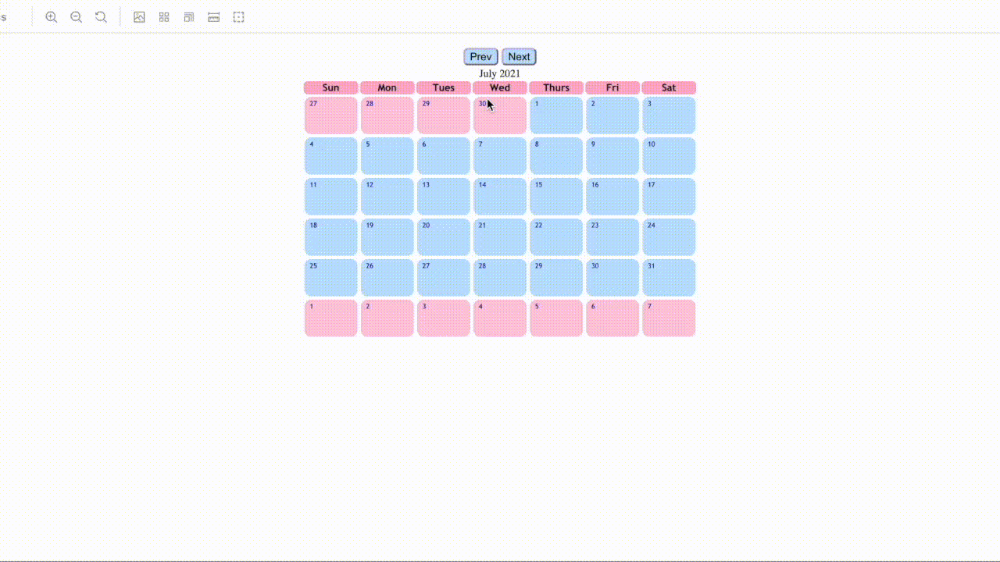

# React Interactive Calendar synced with React Frappe Charts Graph

A calendar with React Frappe Charts created for the convenience of mapping calendar inputs to a simple chart. Most lightweight NPM chart available and the graph is a separate component that is not required to be used.

## Installation

    npm install --save mapped-calendar-graph

## Usage

    import React, { useState } from 'react'
    import { Calendar } from 'mapped-calendar-graph'
    import { Graph } from 'mapped-calendar-graph'

    export default function MyChart(props) {
        const [map, setMap] = useState(new Map());
        return (
            

                <Calendar map={map} setMap={setMap}></Calendar>
                {map.size > 0 && <Graph map={map}></Graph>}
            

        );
    }

